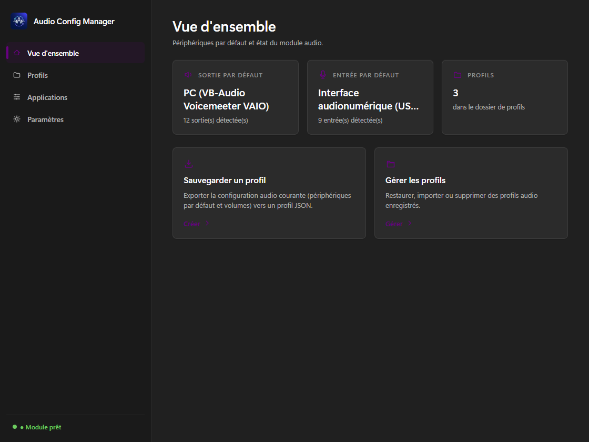
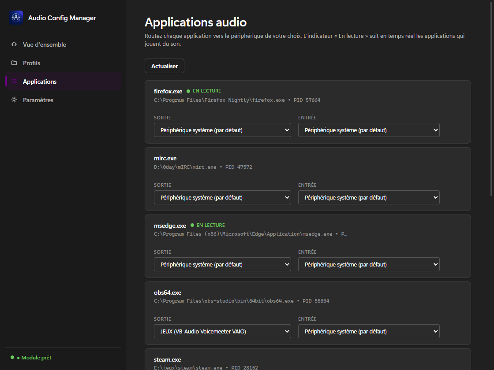

# Audio Config Manager

Gestion de la configuration audio Windows : périphériques par défaut
(sortie/entrée), volumes et **routage audio par application**, sauvegardés
dans des **profils JSON**.



## Fonctionnalités

- **Profils** : sauvegarde et restauration des périphériques par défaut
  (sortie/entrée) et des volumes ; aperçu avant restauration ; import/export
  JSON ; sauvegardes automatiques (avant restauration, au démarrage, sur
  changement de périphérique) avec rétention.
- **Routage par application** : choisis le périphérique de sortie et
  d'entrée de chaque application (ex. *Xbox → une autre carte son*), via
  l'API interne de Windows (`AudioPolicyConfig`).
- **Vue d'ensemble** : état des périphériques, volumes, installation du
  module AudioDeviceCmdlets en un clic.
- **Interface** : Mica, thème clair/sombre automatique, couleur d'accent
  système.



## Télécharger

Exécutable portable (aucune installation) sur la page
[Releases](https://github.com/Endymi0n74/Audio-Config-Manager/releases) —
seule condition : le runtime WebView2 (présent par défaut sur Windows 10/11).

## Compiler

Windows uniquement :

```powershell
npm install
npm run tauri dev      # développement
.\build-release.ps1    # build release — une seule commande
```

La CLI de débogage du routage est une sous-commande du binaire principal :
`"Audio Config Manager.exe" route sessions|devices|get|set`.

## Documentation

- [Architecture](docs/ARCHITECTURE.md) · [Format des profils](docs/SCHEMA.md) · [Build](docs/BUILD.md)
